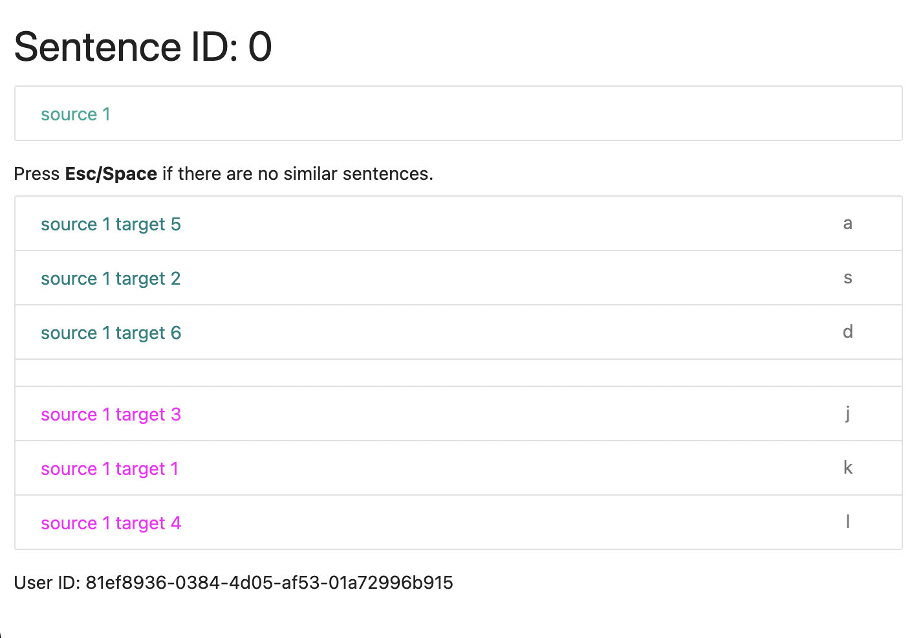

Semantic Similarity Evaluator (SSE)
===================================

Simple tool to allow an annotator to look at a source sentence, and pick the most similar sentence out of a set of sentences.

This was written as a quick tool for a very specific type of annotation for a machine translation paper, and isn't expected to be ever made into something general purpose.

Name is intentionally confusing so that as little people use it as possible. This is not a well-written piece of software.

Preview
-------

Requirements
------------

 - Python 3.8+
 - pip install -r requirements.txt

Running
-------

    flask run --host=0.0.0.0

Disclaimer
----------

This is not an official Google product.
